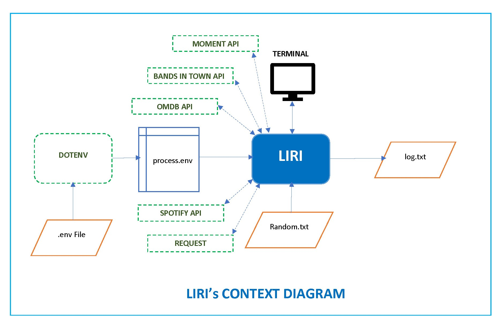

# liri-node-app
LIRI is a command line app that finds song or movie information for a given song or a movie. It also finds upcoming concerts around the world for a given artist.

## High Level Design
The context diagram below show the various modules used to implement LIRI. It utilizes the following external pacakges:

 * [Node-Spotify-API](https://www.npmjs.com/package/node-spotify-api)

 * [Request](https://www.npmjs.com/package/request)

 * [OMDB API](http://www.omdbapi.com)

 * [Bands In Town API](http://www.artists.bandsintown.com/bandsintown-api)

 * [Moment](https://www.npmjs.com/package/moment)

 * [DotEnv](https://www.npmjs.com/package/dotenv)




### How to Use LIRI

1. `node liri.js concert-this <artist/band name here>`

   * This will search the Bands in Town Artist Events API (`"https://rest.bandsintown.com/artists/" + artist + "/events?app_id=codingbootcamp"`) for an artist and render the following information about each event to the terminal:

     * Name of the venue

     * Venue location

     * Date of the Event (use moment to format this as "MM/DD/YYYY")

2. `node liri.js spotify-this-song '<song name here>'`

   * This will show the following information about the song in your terminal/bash window

     * Artist(s)

     * The song's name

     * A preview link of the song from Spotify

     * The album that the song is from

   * If no song is provided then it defaults to "The Sign" by Ace of Base.

3. `node liri.js movie-this '<movie name here>'`

   * This will output the following information to your terminal/bash window:

     ```
       * Title of the movie.
       * Year the movie came out.
       * IMDB Rating of the movie.
       * Rotten Tomatoes Rating of the movie.
       * Country where the movie was produced.
       * Language of the movie.
       * Plot of the movie.
       * Actors in the movie.
     ```

   * If no movie is provided LIRI will  output data for the movie 'Mr. Nobody.'


4. `node liri.js do-what-it-says`

   * LIRI will take the text inside of random.txt and then use it to call one of LIRI's commands. The text in random.txt should be in the same format as given in steps 1 to 3 above.  

    